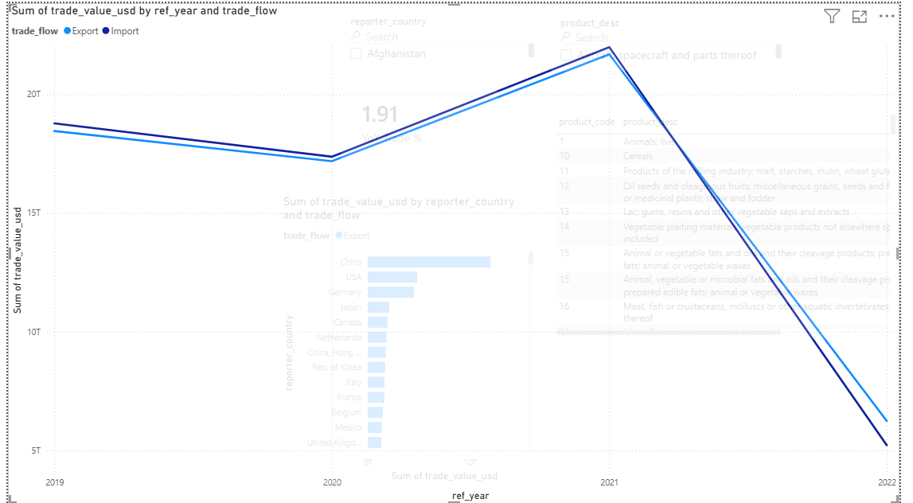
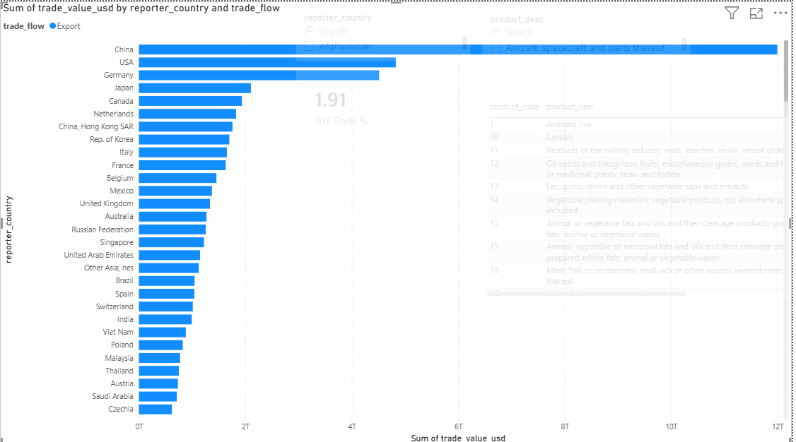

# Global Trade Analytics Dashboard  
**PostgreSQL | Advanced SQL | Power BI**

---

## Project Overview

This project delivers an end-to-end analytics solution for global trade data sourced from the UN Comtrade dataset. The objective was to design a robust data pipeline that transforms raw CSV files into analytics-ready fact tables and delivers meaningful insights through interactive Power BI dashboards.

The project focuses on real-world data challenges such as schema mismatches, data type inconsistencies, and scalable aggregation strategies commonly encountered in enterprise analytics environments.

---

## Architecture

→ Staging Layer
→ Raw Data Layer
→ Fact Table
→ SQL Analytics Views
→ Power BI Dashboard

Each layer is purpose-built to ensure data reliability, performance, and analytical clarity.

---

## Tools and Technologies

- PostgreSQL  
- Advanced SQL (aggregations, window functions, analytical views)  
- Power BI (DAX, interactive visuals)  
- GitHub (version control and documentation)  

---

## Data Modeling Approach

### Staging Layer
- Mirrors the CSV schema exactly for safe data ingestion  
- Handles raw, unvalidated data without transformations  

### Raw Data Layer
- Standardizes column naming conventions  
- Applies consistent data types  
- Serves as a stable source of truth  

### Fact Layer
- Optimized for analytical queries and BI consumption  
- Contains clean measures and dimensional attributes  
- Supports efficient aggregations and slicing  

### Analytics Views
- Pre-aggregated SQL views for common business questions  
- Improves Power BI performance  
- Simplifies dashboard logic  

---

## Key Analytics Implemented

- Import vs Export trends over time  
- Top 10 traded products per year using SQL window functions  
- Top 10 trading countries per year  
- Annual trade balance (Exports minus Imports)  
- Year-over-Year trade growth using Power BI DAX measures  

---

## SQL Highlights

- Multi-layer data pipeline design (staging → raw → fact)  
- Window functions (`ROW_NUMBER`, `DENSE_RANK`) for Top-N analysis  
- Conditional aggregations for financial metrics  
- Performance-oriented grouping and filtering strategies  

---

## Power BI Dashboard Features

- Interactive line charts for import and export trends  
- Bar charts highlighting top countries and products  
- Trade balance visualization over time  
- Year and trade flow slicers for dynamic analysis  
- Clear separation of SQL logic and DAX calculations  
## Dashboard Preview

### Import vs Export Trends
This view compares annual import and export values to highlight trade flow patterns over time.

---

### Top 10 Trading Countries
Displays the leading trading countries based on total trade value for the selected year.

---

### Top 10 Products by Trade Value
Highlights the most traded product categories using SQL window functions and aggregated metrics.

---

### Trade Balance Over Time
Shows the annual trade balance calculated as total exports minus total imports.

---

## Repository Structure
global-trade-analytics/
│
├── README.md
│
├── data/
│   ├── trade_uncomtrade_raw.csv
│   └── trade_uncomtrade_processed.csv
│
├── sql/
│   ├── schema.sql
│   ├── stage.sql
│   ├── raw.sql
│   ├── fact.sql
│   ├── analytics_views.sql
│   └── trade_balance.sql
│
├── powerbi/
│   └── Global_Trade_Analytics.pbix
│
├── screenshots/
│   ├── import_export_trends.png
│   ├── top_countries.png
│   ├── top_products.png
│   └── trade_balance.png
│
└── docs/
    ├── data_model.md
    └── architecture.md

---
## SQL Pipeline

SQL scripts are stored in the `sql/` directory:

- `schema.sql` – Creates the project schema
- `stage.sql` – Defines the staging table for CSV ingestion
- `raw.sql` – Standardizes columns into a raw layer
- `fact.sql` – Builds the analytics-ready fact table
- `analytics_views.sql` – Creates Top-N and trend views using window functions
- `trade_balance.sql` – Computes annual exports, imports, and trade balance

Scripts are designed to be executed in the order listed above after loading the CSV into the staging table.
---
## How to Use This Project

1. Load the CSV data into PostgreSQL using the staging scripts  
2. Execute SQL scripts in sequence to build raw, fact, and analytics layers  
3. Open the Power BI file and refresh the dataset  
4. Explore insights using filters and interactive visuals  

---

## About This Project

This project was built to demonstrate strong analytical thinking, advanced SQL expertise, and practical Power BI dashboard development aligned with Data Analyst, Business Intelligence Analyst, and Analytics Engineer roles.
